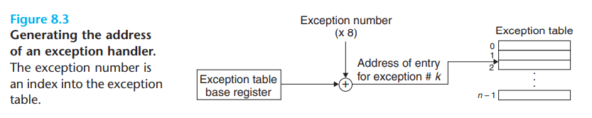
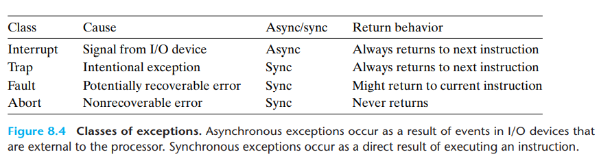
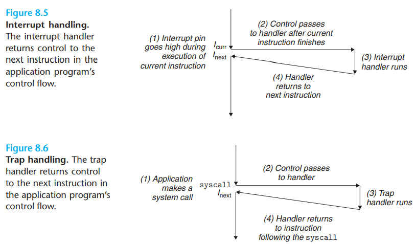
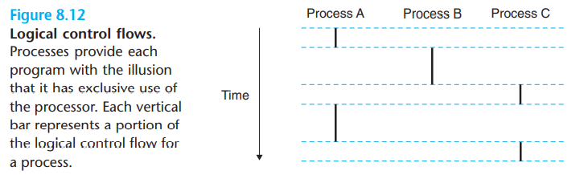
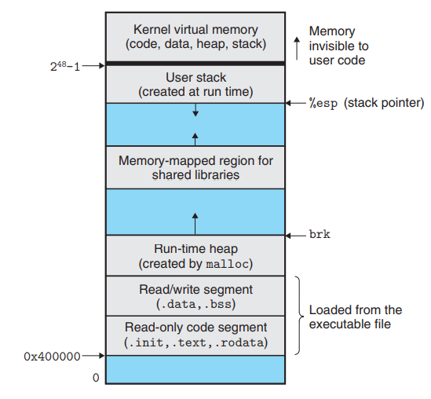
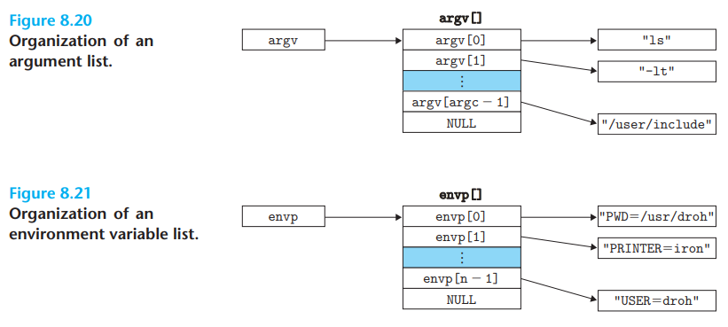
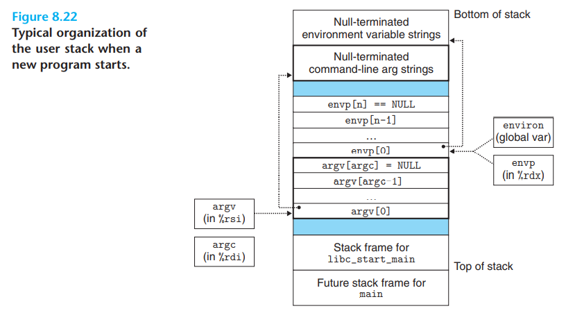

# Exceptional Control Flow

But systems must also be able to **react to changes in system state** that are not captured by internal program variables and are not necessarily related to the execution of the program. Modern systems react to these situations by **making abrupt changes in the control flow.** In general, we refer to these abrupt changes as exceptional control flow (ECF).

## Exceptions

Exceptions are a form of exceptional control flow that are implemented **partly by the hardware** and **partly by the operating system**.

An exception is an abrupt change in the control flow in response to some change in the processor’s state.


In any case, when the **processor detects** that the event has occurred, it makes an **indirect procedure call (the exception)**, through a jump table called an exception table, to an operating system subroutine (the exception handler) that is specifically designed to process this particular kind of event. When the exception handler finishes processing, one of three things happens, depending **on the type of event** that caused the exception:

1. The handler returns control to the current instruction $I_{curr}$, the instruction that was executing when the event occurred.. 
2. The handler returns control to $I_{next}$, the instruction that would have executed next had the exception not occurred.
3. The handler aborts the interrupted program

### Exception Handling

Each type of possible exception in a system is assigned a unique nonnegative integer exception number. Some of these numbers are assigned by the **designers of the processor**. Other numbers are assigned by the **designers of the operating system kernel** (the memory-resident part of the operating system)

At system boot time (when the computer is reset or powered on), **the operating system allocates and initializes a jump table called an exception table**, so that entry k contains the address of the handler for exception k

At run time (when the system is executing some program), **the processor detects** that an event has occurred and determines the corresponding exception number k. The processor then **triggers** the exception by making an **indirect procedure call**, through entry k of the exception table, to the corresponding handler.



When control is being transferred from a user program to the kernel, all of these items are **pushed onto the kernel’s stack rather than onto the user’s stack**.

### classes of exceptions

interrupts, traps, faults, and aborts.



Interrupts occur asynchronously as a **result of signals from I/O devices** that are external to the processor .they are **not caused by the execution of any particular instruction**. I/O devices such as **network adapters, disk controllers, and timer chips trigger** **interrupts by signaling a pin on the processor chip and placing onto the system bus** the exception number that identifies the device that caused the interrupt

Traps are intentional exceptions that occur **as a result of executing an instruction**. The most important use of traps is to provide a **procedure-like interface between user programs and the kernel**, known as a **system call**



**Faults result from error conditions that a handler might be able to correct** If the handler is able to correct the error condition, it returns control to the faulting instruction, thereby re-executing it. Otherwise, the handler returns to an abort routine in the kernel that terminates the application program that caused the fault. A classic example of a fault is the **page fault exception**, which occurs when an instruction references a virtual address whose corresponding page is not resident in memory and must therefore be retrieved from disk.

**Aborts** result from **unrecoverable fatal errors**, typically hardware errors such as parity errors that occur when DRAM or SRAM bits are corrupted.


Linux/x86-64 Faults and Aborts

1.  **Divide error**. A divide error (exception 0) occurs when an application attempts to divide by zero or when the result of a divide instruction is too big for the destination operand.
2. **General protection fault**. The infamous general protection fault (exception 13) occurs for many reasons, usually because a program references an undefined area of virtual memory or because the program attempts to write to a read-only text segment
3. Page fault. A page fault (exception 14) is an example of an exception where the faulting instruction is restarted. The handler maps the appropriate page of virtual memory on disk into a page of physical memory and then restarts the faulting instruction
4. Machine check. A machine check (exception 18) occurs as a result of a fatal hardware error that is detected during the execution of the faulting instruction.

Linux/x86-64 System Calls


## processes

The classic definition of a process is an **instance of a program in execution.**

we will focus on the key abstractions that a process provides to the application: 

1. An independent logical control flow that provides the illusion that our program has exclusive use of the processor. 
2. A private address space that provides the illusion that our program has exclusive use of the memory system


###  Logical Control Flow

If we were to use a debugger to single-step the execution of our program, we would observe **a series of program counter** (PC) values that corresponded **exclusively** to instructions contained in our program’s **executable object file or in shared objects** linked into our program dynamically at run time. This **sequence of PC values** is known as a **logical control flow, or simply logical flow**



The key point in Figure 8.12 is that processes take turns using the processor. Each process **executes a portion of its flow and then is preempted (temporarily suspended) while other processes take their turns**

### concurrent flows

A logical flow whose execution overlaps in time with another flow is called a concurrent flow, and the two flows are said to run concurrently. More precisely, flows X and Y are concurrent with respect to each other if and only if X begins after Y begins and before Y finishes, or Y begins after X begins and before X finishes

The general phenomenon of multiple flows executing concurrently is known as **concurrency**. The notion of a process taking turns with other processes is also known as **multitasking**

### private address space



The bottom portion of the address space is reserved for the user program, with the usual code, data, heap, and stack segments.

### User and Kernel modes

Processors typically provide this capability with a **mode bit** in some control register that characterizes the privileges that the process currently enjoys. **When the mode bit is set,** the process is running in **kernel mode** (sometimes called supervisor mode). A process running in kernel mode can execute **any instruction** in the instruction set and access any memory location in the system. When the mode bit **is not set**, the process is running in **user mode**. A process in user mode is not allowed to execute **privileged instructions** that do things such as halt the **processor, change the mode bit, or initiate an I/O operation**. Nor is it allowed to directly reference code or data in the kernel area of the address space.

A process running application code is initially **in user mode**. The **only way** for the process to change from user mode to kernel mode is **via an exception** such as an interrupt, a fault, or a trapping system call. 

Linux provides a clever mechanism, called the **/proc** filesystem, that allows **user mode processes to access the contents of kernel data structures** such as CPU type

### context switch

The operating system kernel implements **multitasking** using a **higher-level form of exceptional control** flow known as a **context switch**

The kernel maintains **a context for each process.** The context is the state that the kernel needs to restart a preempted process. It consists of the values of objects such as **the general-purpose registers, the floating-point registers, the program counter, user’s stack, status registers, kernel’s stack, and various kernel data structures such as a page table that characterizes the address space, a process table that contains information about the current process, and a file table that contains information about the files that the process has opened.**

At certain points during the execution of a process, the kernel can **decide to preempt the current process and restart a previously preempted process**. This decision is known as **scheduling** and is handled by code in the kernel, called the **scheduler** .After the kernel has scheduled a new process to run, it preempts the current process and transfers control to the new process using a mechanism called a **context switch** that 

1. saves the context of the current process
2. restores the saved context of some previously preempted process,
3. passes control to this newly restored process.

A context switch can occur while the **kernel is executing a system call on behalf of the user**. A context switch can also occur **as a result of an interrupt**. For example, all systems have some mechanism for generating **periodic timer interrupts**, typically every 1 ms or 10 ms. Each time a timer interrupt occurs, the **kernel can decide that the current process has run long enough and switch to a new process**

## system call error handling


When Unix system-level functions encounter an error, they typically return −1 and set the global integer variable `errno` to indicate what went wrong. Programmers should always check for errors

```c
if ((pid = fork()) < 0) {
	fprintf(stderr, "fork error: %s\n", strerror(errno));
	exit(0);
}
```

## process control

#### obtain process ids

```c
#include <sys/types.h>
#include <unistd.h>

pid_t getpid(void);
pid_t getppid(void);
//Returns: PID of either the caller or the parent
```


#### creating and terminating processes

we can think of a process as being in one of three states

1. **running**   The process is either executing on the CPU or waiting to be executed and will eventually be scheduled by the kernel
2. **stopped**  The execution of the process is suspended and will not be scheduled.
3. **Terminated** The process is stopped permanently

```c
#include <stdlib.h>
void exit(int status);
//This function does not return
```

```c
#include <sys/types.h>
#include <unistd.h>
pid_t fork(void);
//Returns: 0 to child, PID of child to parent, −1 on error
```

The newly created child process is almost, but not quite, **identica**l to the parent. The child **gets an identical (but separate) copy of the parent’s user-level virtual address space,** including the code and data segments, heap, shared libraries, and user stack. The child also gets identical copies of any of the parent’s open file descriptors, which means the **child can read and write any files that were open in the parent when it called fork**. The most significant difference between the parent and the newly created child is that they have different PIDs.

The fork function is interesting (and often confusing) because **it is called once but it returns twice**: once in the calling process (the parent), and once in the newly created child process. In the **parent**, fork returns the PID of the child. In the **child**, fork returns a value of **0**

reaping child processes

When a process terminates for any reason, the kernel does not remove it from the system immediately. **Instead, the process is kept around in a terminated state until it is reaped by its parent** When the parent reaps the terminated child, the kernel passes the child’s exit status to the parent and then discards the terminated process, at which point it ceases to exist. A terminated process that has not yet been reaped is called a **zombie**.

When a parent process terminates, the kernel arranges for the `init process` to become the `adopted parent` of any `orphaned children`. The `init process`, which has a **PID of 1**, is created by the `kernel` during system start-up, **never terminates**, and is the **ancestor of every process**. If a parent process terminates without reaping its zombie children, then the kernel arranges for the `init process` to reap them


```c
#include <sys/types.h>
#include <sys/wait.h>
pid_t waitpid(pid_t pid, int *statusp, int options);
//Returns: PID of child if OK, 0 (if WNOHANG), or −1 on error
```

The `waitpid` function is complicated. By default (when options = 0), `waitpid` suspends execution of the calling process until a child process in its wait set terminates. If a process in the wait set has already terminated at the time of the call, then `waitpid` returns immediately. In either case, `waitpid` returns the PID of the terminated child that caused `waitpid` to return. At this point, the terminated child has been reaped and the kernel removes all traces of it from the system.

The members of the wait set are determined by the `pid` argument:

1. If `pid` > 0, then the wait set is the singleton child process whose process ID is equal to `pid`.
2. If `pid` = -1, then the wait set consists of all of the parent’s child processes

If the `statusp` argument is non-NULL, then `waitpid` encodes status information about the child that caused the return in status, which is the value pointed to by `statusp`. The `wait.h` include file defines several macros for interpreting the status argument:

If the calling process has no children, then `waitpid` returns −1 and sets `errno` to `ECHILD`. If the `waitpid` function was interrupted by a signal, then it returns −1 and sets `errno` to EINTR

The wait function is a simpler version of `waitpid`

```c
#include <sys/types.h>
#include <sys/wait.h>
pid_t wait(int *statusp);
//Returns: PID of child if OK or −1 on error
```

Calling ```wait(&status)``` is equivalent to calling `waitpid(-1, &status, 0)`.

putting processes to sleep

```c
#include <unistd.h>
unsigned int sleep(unsigned int secs);
//Returns: seconds left to sleep
```

Another function that we will find useful is the `pause` function, which puts the calling function to sleep until a signal is received by the process.

```c
#include <unistd.h>
int pause(void);
//Always returns −1
```

The `execve` function loads and runs a new program in the context of the current process

```c
#include <unistd.h>
int execve(const char *filename, const char *argv[], const char *envp[]);
//Does not return if OK; returns −1 on error
```

The `execve` function loads and runs the executable object file filename with the argument list `argv` and the environment variable list `envp`





## signals

a higher-level software form of exceptional control flow, known as a Linux signal, that allows processes and the kernel to interrupt other processes.

The transfer of a signal to a destination process occurs in two distinct steps

1. Sending a signal: The kernel sends (delivers) a signal to a destination process by **updating some state in the context of the destination process**. The signal is delivered for one of two reasons
   1. The kernel has **detected a system event** such as a divide-by-zero error or the termination of a child process
   2. A process has **invoked the kill function** (discussed in the next section) to explicitly request the kernel to send a signal to the destination process
2. Receiving a signal: A destination process receives a signal when it is forced by the kernel to react in some way to the delivery of the signal. The process can either **ignore the signal, terminate, or catch** the signal by executing a user-level **function called a signal handler**.

A signal that has been sent but not yet received is called a **pending signal**. At any point in time, there can be at most one pending signal of a particular type. If a process has a pending signal of type k, then any subsequent signals of type k sent to that process are **not queued; they are simply discarded**


### sending signals

Unix systems provide a number of mechanisms for sending signals to processes. All of the mechanisms rely on the notion of a **process group**

Every process belongs to exactly one process group, which is identified by a positive integer process **group ID**.

```c
#include <unistd.h>
pid_t getpgrp(void);
//Returns: process group ID of calling process
```

By default, **a child process belongs to the same process group as its parent**. A process can change the process group of itself or another process by using the `setpgid` function

```c
#include <unistd.h>
int setpgid(pid_t pid, pid_t pgid);
//Returns: 0 on success, −1 on error
```

Sending Signals with the /bin/kill Program

```bash
linux> /bin/kill -9 15213
//sends signal 9 (SIGKILL) to process 15213
```

Sending Signals from the Keyboard

Unix shells use the **abstraction of a job** to represent the processes that are **created as a result of evaluating a single command line**. At any point in time, there is at most **one foreground job and zero or more background jobs**. For example, typing

```bash
ls | sort
```

creates a foreground job consisting of two processes connected by a **Unix pipe**: one running the `ls` program, the other running the `sort` program. The shell creates a separate process group for each job


Sending Signals with the kill Function

```c
#include <sys/types.h>
#include <signal.h>
int kill(pid_t pid, int sig);
//Returns: 0 if OK, −1 on error
```

Sending Signals with the alarm Function

A process can send SIGALRM signals to itself by calling the alarm function.

```c
#include <unistd.h>
unsigned int alarm(unsigned int secs);
//Returns: remaining seconds of previous alarm, or 0 if no previous alarm
```

The alarm function arranges for the kernel to send a SIGALRM signal to the calling process in secs seconds

### Receiving Signals

When the kernel switches a process p **from kernel mode to user mode** (e.g., returning from a system call or completing a context switch), it checks **the set of unblocked pending signals** (pending & ~blocked) for p. If this set is **empty** (the usual case), then the kernel passes control to the **next instruction** (`Inext`) in the logical control flow of p. However, if the set is **nonempty**, then the kernel **chooses some signal k in the set** (typically the smallest k) and **forces p to receive signal k**. The receipt of the signal **triggers some action by the process**. Once the process **completes** the action, then control passes back to the next **instruction** (`Inext`) in the logical control flow of p. Each signal type has a predefined default action, which is one of the following:

1. The process terminates
2. The process terminates and dumps core.
3. The process terminates and dumps core.
4. The process ignores the signal

A process can modify the default action associated with a signal by using the signal function. The only exceptions are **SIGSTOP** and **SIGKILL**, whose default actions cannot be changed.

```c
#include <signal.h>
typedef void (*sighandler_t)(int);
sighandler_t signal(int signum, sighandler_t handler);
//Returns: pointer to previous handler if OK, SIG_ERR on error (does not set errno)
```

The signal function can change the action associated with a signal signum in one of three ways

1. If handler is SIG_IGN, then signals of type signum are ignored.
2. If handler is SIG_DFL, then the action for signals of type signum reverts to the default action
3. Otherwise, handler is the **address of a user-defined function,** called a **signal handler**, that will be called whenever the process receives a signal of type signum. Changing the default action by passing the address of a handler to the signal function is known as **installing the handler**, The invocation of the handler is called **catching the signal**. The execution of the handler is referred to as **handling the signal**


### blocking and unblocking signals