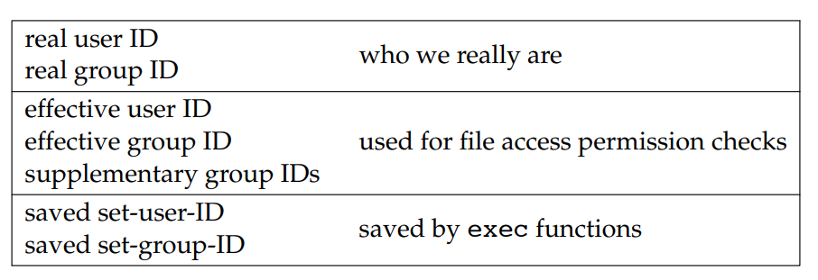
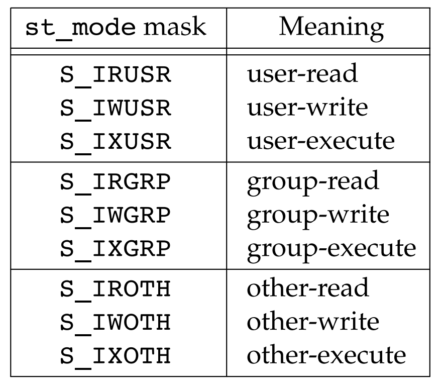

# Files and Directories

[toc]


## 4.1	Introduction

We’ll now look at additional features of the file system and the properties of a file

We’ll also look in more detail at the structure of a UNIX file system and symbolic links. We finish this chapter with the functions that operate on directories,


## 4.2	`stat`, `fstat`, `fstatat`, `lstat`

```c
#include <sys/stat.h>
int stat(const char *restrict pathname, struct stat *restrict buf );
int fstat(int fd, struct stat *buf );
int lstat(const char *restrict pathname, struct stat *restrict buf );
int fstatat(int fd, const char *restrict pathname,
struct stat *restrict buf, int flag);
//All four return: 0 if OK, −1 on error
```

Given a pathname, the `stat` function returns a **structure of information** about the named file

The `fstat` function obtains information about the file that is **already open** on the descriptor `fd`

The `lstat` function is similar to stat, but when the named file is a **symbolic link**, `lstat` returns **information about the symbolic link**, not the file referenced by the symbolic link.

The `fstatat` function provides a way to return the **file statistics** for a **pathname** relative to an open directory represented by the `fd` argument. The `flag` argument controls whether symbolic links are followed;

The `buf` argument is a pointer to a structure that we must supply

```c
struct stat {
	mode_t st_mode; /* file type & mode (permissions) */
	ino_t st_ino; /* i-node number (serial number) */
	dev_t st_dev; /* device number (file system) */
	dev_t st_rdev; /* device number for special files */
	nlink_t st_nlink; /* number of links */
	uid_t st_uid; /* user ID of owner */
	gid_t st_gid; /* group ID of owner */
	off_t st_size; /* size in bytes, for regular files */
	struct timespec st_atim; /* time of last access */
	struct timespec st_mtim; /* time of last modification */
	struct timespec st_ctim; /* time of last file status change */
	blksize_t st_blksize; /* best I/O block size */
	blkcnt_t st_blocks; /* number of disk blocks allocated */
};
```

The `timespec` structure type defines time in terms of seconds and nanoseconds. It includes at least the following fields: 

```c
time_t tv_sec; 
long tv_nsec;
```

The biggest user of the stat functions is probably the `ls -l` command, to learn all the information about a file

## 4.3	File Types

1. `Regular file`. The most common type of file, which contains data of some form. There is **no distinction** to the UNIX kernel whether this data is text or binary. Any **interpretation of the contents of a regular file is left to the application processing the file**.
2. `Directory file`. A file that contains the names of other files and pointers to information on these files. Any process that has **read permission** for a directory file can read the contents of the directory, but **only the kernel** can **write directly to a directory file**.
3. `Block special file` A type of file providing **buffered I/O access** in fixed-size units to devices such as disk drives
4. `Character special file` A type of file providing **unbuffered I/O access** in variable-sized units to devices. 
5. `FIFO`. A type of file used for **communication between processes**. It’s sometimes called a named pipe.
6. `Socket`.A type of file used for **network communication** between processes. A socket can also be used for **non-network communication between processes on a single host**.
7. `Symbolic link`. A type of file that points to another file.


POSIX.1 allows implementations to **represent interprocess communication** (IPC) objects, such as message queues and semaphores, as files. T


## 4.4	Set-User-ID and Set-Group-ID

Every process has six or more IDs associated with it.



- The real user ID and real group ID identify who we really are. These two fields are taken from our entry in the password file when we log in. Normally, these values don’t change during a login session, although there are ways for a superuser process to change them,
- The effective user ID, effective group ID, and supplementary group IDs determine our file access permissions
-  The saved set-user-ID and saved set-group-ID contain copies of the effective user ID and the effective group ID, respectively, when a program is executed.


When we **execute a program file**, the effective user ID of the process is usually the real user ID, and the effective group ID is usually the real group ID

However, we can also set a **special flag** in the file’s mode word (`st_mode`) that says, ‘‘When this file is executed, set the **effective user ID** of the process to be the owner of the file (`st_uid`).’’ Similarly, we can set another bit in the file’s mode word that causes the **effective group ID** to be the **group owner of the file** (`st_gid`). 

These two bits in the file’s mode word are called the **set-user-ID** bit and the **set-group-ID** bit

For example, if the **owner** of the file is the **superuser** and if the file’s **set-user-ID** bit is set, then while that program file is running as a process, it has **superuser privileges**. This happens **regardless of the real user ID of the process that executes the file**. (the UNIX System program that allows anyone to change his or her password,)


## 4.5 File Access Permissions

There are nine permission bits for each file, divided into three categories.



The term user in the first three rows in Figure 4.6 refers to the owner of the file.

We’ll summarize them here, and return to them when we describe the actual functions

- whenever we want to open any type of file by name, we must have **execute permission in each directory mentioned in the name,** including the current directory, if it is implied. This is why the **execute permission bit for a directory** is often called the **search bit**. 

  

  For **example**, to open the file `/usr/include/stdio.h`, we need execute permission in the directory /, execute permission in the directory `/usr`, and execute permission in the directory `/usr/include`. We then need appropriate permission for the file itself, depending on how we’re trying to open it: read-only, read–write, and so on. 

  

  Note that **read permission** for a directory and **execute permission** for a directory mean different things. **Read permission** lets us **read the directory**, obtaining a list of all the **filenames** in the directory.  Execute permission lets us **pass through** the directory when it is a component of a pathname that we are trying to access.

  

  when no read permission,  we can read and write files in the directory if we know the names before but `ls` is ``permission denied`` 

  when no execute permission we can't read or write files in the directory even though we know the name and we can't enter the directory while the `ls` command is allowed but we can only know the names of files in it while most of other information is denied

  ```bash
  ~ ➤ ls -al temp
  ls: cannot access 'temp/a.txt': Permission denied
  ls: cannot access 'temp/..': Permission denied
  ls: cannot access 'temp/.': Permission denied
  total 0
  d????????? ? ? ? ?            ? .
  d????????? ? ? ? ?            ? ..
  -????????? ? ? ? ?            ? a.txt
  ```

- The read permission for a file determines whether we can open an existing file for reading: the O_RDONLY and O_RDWR flags for the open function.

-  The write permission for a file determines whether we can open an existing file for writing: the O_WRONLY and O_RDWR flags for the open function

- We must have write permission for a file to specify the O_TRUNC flag in the open function

- We cannot create a new file in a directory unless we have write permission and execute permission in the directory.

- To delete an existing file, we need write permission and execute permission in the directory containing the file. We do not need read permission or write permission for the file itself

- Execute permission for a file must be on if we want to execute the file using any of **the seven exec functions**. The file also has to be a regular file.

```
#include <unistd.h>
int execl(const char *pathname, const char *arg0, ... /* (char *)0 */ );
int execv(const char *pathname, char *const argv[]);
int execle(const char *pathname, const char *arg0, ...
/* (char *)0, char *const envp[] */ );
int execve(const char *pathname, char *const argv[], char *const envp[]);
int execlp(const char *filename, const char *arg0, ... /* (char *)0 */ );
int execvp(const char *filename, char *const argv[]);
int fexecve(int fd, char *const argv[], char *const envp[]);
All seven return: −1 on error, no return on success
```

The file access tests that the kernel performs each time a process opens, creates, or deletes a file depend on the owners of the file (`st_uid` and `st_gid`), the effective IDs of the process (effective user ID and effective group ID), and the supplementary group IDs of the process, if supported. The tests performed by the kernel are as follows:

- If the effective user ID of the process is 0 (the superuser), access is allowed. This gives the superuser free rein throughout the entire file system.
- If the effective user ID of the process **equals the owner ID** of the file (i.e., the process owns the file), access is allowed if the appropriate user access permission bit is set. Otherwise, permission is denied. 
- If the effective group ID of the process or one of the supplementary group IDs of the process **equals the group ID** of the file, access is allowed if the appropriate group access permission bit is set. Otherwise, permission is denied.
- If the appropriate other access permission bit is set, access is allowed. Otherwise, permission is denied.

These four steps are tried in sequence. Note that if the process owns the file (step 2), **access is granted or denied based only on the user access permissions; the group permissions are never looked at.**

## 4.6 Ownership of New Files and Directories

The user ID of a new file is set to the effective user ID of the process. POSIX.1 allows an implementation to choose one of the following options to determine the group ID of a new file:

1. The group ID of a new file can be the effective group ID of the process.
2. The group ID of a new file can be the group ID of the directory in which the file is being created

Using the second option—inheriting the directory’s group ID—assures us that all files and directories created in that directory will have the same group ID as the directory.
